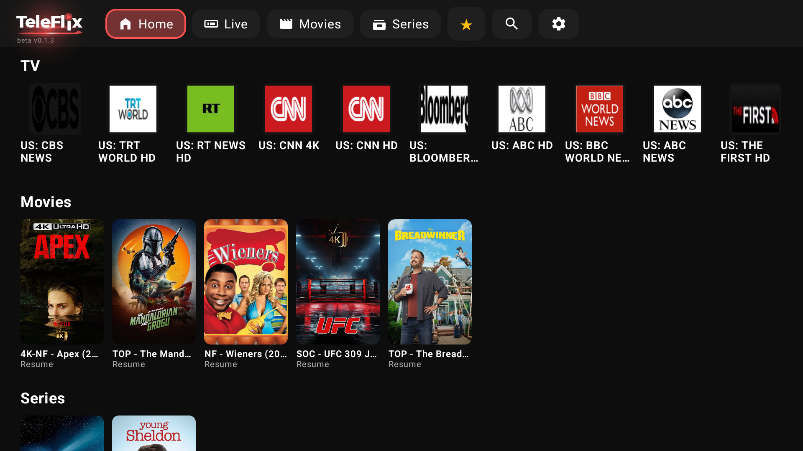
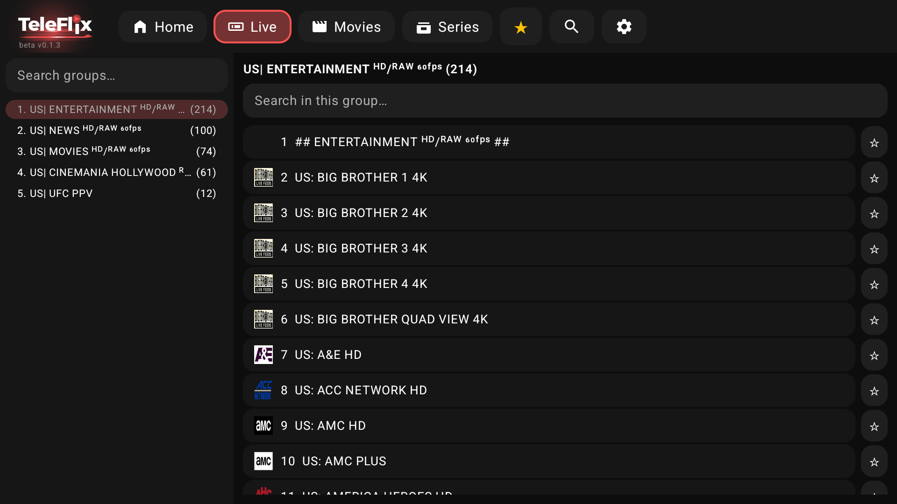
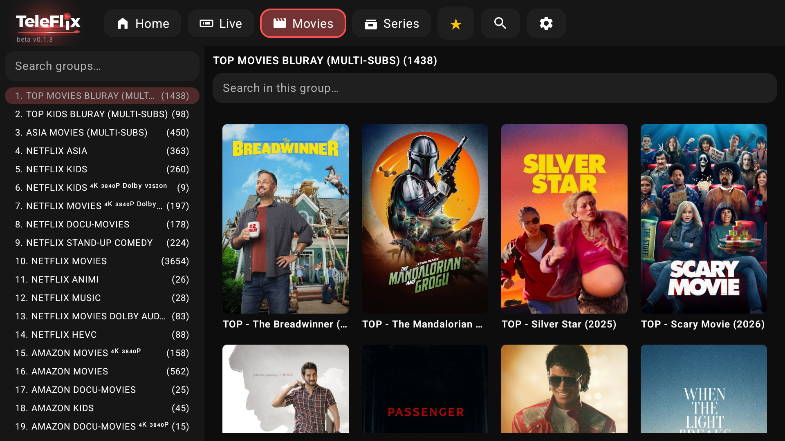
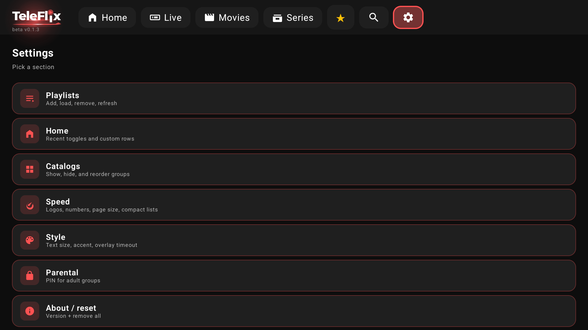
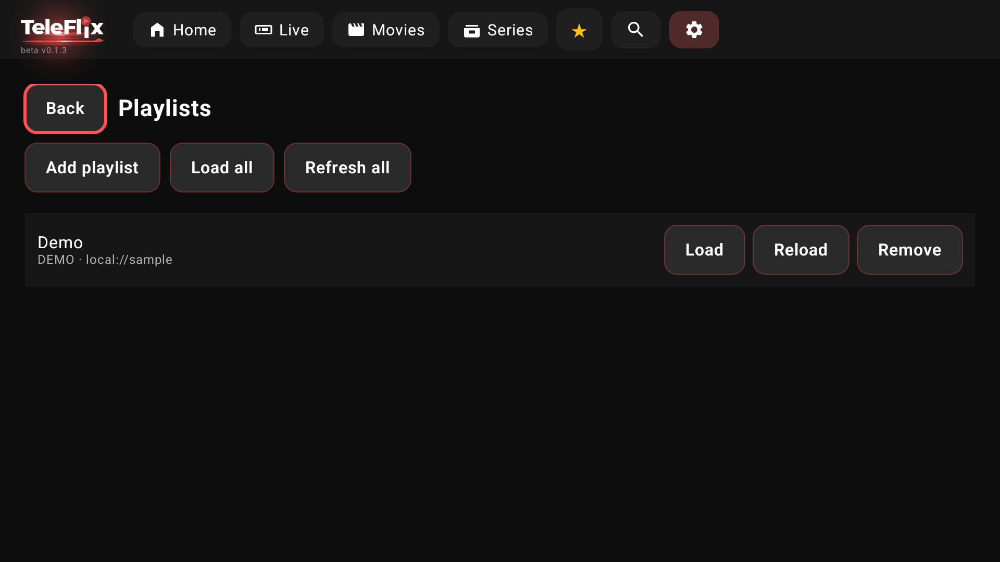
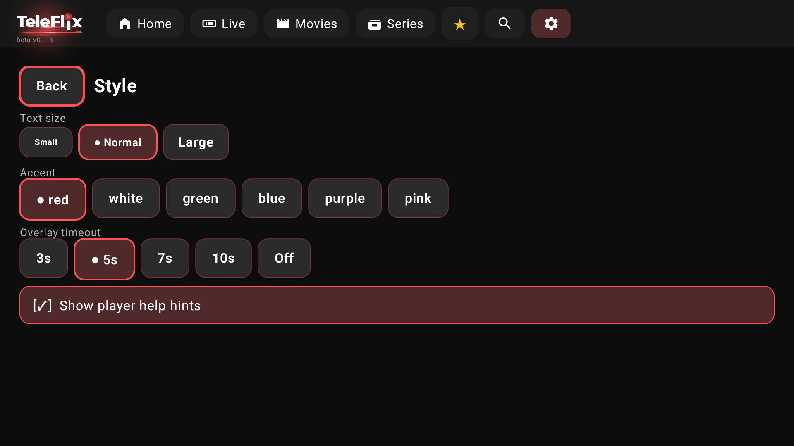

# TeleFlix

**Unofficial beta APKs for Android TV / Google TV** — a remote-friendly IPTV client for *your* Xtream Codes or M3U playlist.

> This repository ships **release APKs only**. Source code is private.  
> Latest: **[beta v0.1.3](https://github.com/josmanov/teleflix/releases/latest)**

[](https://github.com/josmanov/teleflix/releases/latest)
[](https://github.com/josmanov/teleflix/releases)

---

## Screenshots

<p align="center">
  
  &nbsp;
  
</p>
<p align="center">
  
  &nbsp;
  
</p>
<p align="center">
  
  &nbsp;
  
</p>

---

## Features

### Browse
- **Home** — recent Live / Movies / Series rails, plus custom shelves you organize
- **Live · Movies · Series** — group lists with counts, in-group search, series → seasons → episodes
- **Favorites** & **Search** across your catalog
- **Catalogs** — show, hide, and reorder groups

### Playlists
- **Xtream Codes** — URL + username + password; pick Live / Movies / Shows to import
- **M3U** — paste a playlist URL
- Multiple playlists: add, load, reload, refresh all, remove, switch active

### Player
- **Live** — fast zap, neighbor channel strip, hold-to-browse groups/channels
- **VOD** — resume dialog, scrub/seek, auto-hiding controls
- Audio & **subtitle** pickers; subtitle size / color / background / edge
- Favorite toggle from the player chrome
- Quick menu jump to Home / Live / Movies / Series / Settings

### TV & phone
- Built for **Android TV** remotes (D-pad first)
- Also installs on phones — swipe / tap / hold map to remote navigation
- System navigation click sounds
- Accent themes (red default), text sizes, logos, compact lists, and more

### Safety & updates
- **Parental PIN** for locked / adult groups
- **In-app updates** from this release channel (About → Check for updates)

---

## Install

1. Open the **[latest Release](https://github.com/josmanov/teleflix/releases/latest)**
2. Download `TeleFlix-x.y.z.apk`
3. On the TV: allow **Install unknown apps** for your browser / file manager
4. Install the APK (USB, local network, or sideload via `adb`)

```bash
adb install -r TeleFlix-0.1.3.apk
```

**Note:** Keep using builds signed with the same key for updates. Switching from an old debug build may require uninstalling first.

---

## First run

1. Open **Settings → Playlists → Add playlist**
2. Choose **Xtream** or **M3U** and save
3. **Load** the playlist, then browse **Live / Movies / Series**

Demo content may appear until you add your own playlist.

---

## Requirements

- Android **8.0+** (API 26), ideally an **Android TV / Google TV** device
- Network access to your IPTV provider
- Landscape orientation

---

## Copyright

© 2026 **Josmanov**. All rights reserved.

TeleFlix branding and release artifacts in this repository are proprietary.  
APKs here are for end-user installation only. Source code is **not** public.

---

## Disclaimer

TeleFlix is an **unofficial beta** playlist player for Android TV.

- It does **not** include, sell, or host any streams, accounts, or media catalogs.
- You add your own **Xtream Codes** or **M3U** playlist and are responsible for using only credentials / playlists you are allowed to use.
- Not affiliated with any TV network, studio, or streaming service.
- Provided **as-is**, without warranty of any kind.

Screenshots show a personal playlist for UI demonstration only.

---

## Support

- Bugs & APK feedback: open a [GitHub Issue](https://github.com/josmanov/teleflix/issues) on this repo
- Releases & changelog: [Releases](https://github.com/josmanov/teleflix/releases)
